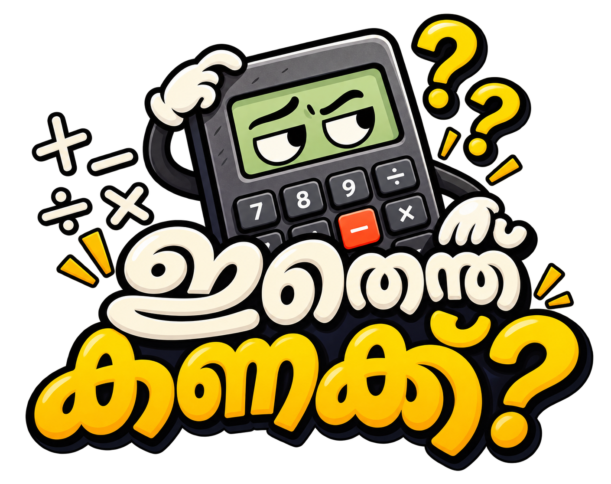

# ഇതെന്ത് കണക്ക്? (Ithenth Kanakku?)

## Live Demo
[ithenth-kanakk.vercel.app](https://ithenthkanakk.vercel.app)

## Basic Details
### Team Name:

### Team Members
- Team Lead: Rohan Kishore

### Project Description
ഇതെന്ത് കണക്ക്? is a playful calculator that intentionally wastes time and is wrong 90% of the time. Its colorful retro interface turns ordinary arithmetic into unnecessary equations, fake verification, absurd predictions, memes, and sarcastic interruptions.

### The Problem (that doesn't exist)
People keep getting calculator answers too quickly and with too little drama.

### The Solution (that nobody asked for)
Three progressively pointless levels transform every calculation into a more elaborate experience, complete with sarcastic commentary, unreliable answers, achievement popups, meme reactions, and a button that makes everything worse.

## Technical Details
### Technologies/Components Used
For Software:
- JavaScript
- React
- Vite
- CSS

For Hardware:

### Implementation
For Software:

# Installation
```bash
cd ithenth-kanakk
npm install
```

# Run
```bash
npm run dev
```

## Uselessness System

### Level 1 — അനാവശ്യം
Attempts a calculation, then disguises the result as an unnecessarily complicated equation. It is correct only occasionally.

### Level 2 — അമിതം
Adds pointless conversions, repeated verification, fake processing, and intermediate steps before showing a result that is usually wrong anyway.

### Level 3 — അസംബന്ധം 
Pretends to predict the next number after an operator, autofills a random guess with absurd confidence, shifts digits, and returns wrong answers with suspicious certainty.

### Controls
- `Make it Worse` increases the pointless complexity within the current level.
- `C` clears the expression.
- `+/-` changes the sign.
- `%` converts a percentage in the expression.
- `Explain steps`, `Verify again`, and `Why?` provide intentionally unhelpful responses.
- Face clicks, division by zero, rapid clicking, and `Make it Worse` can unlock achievements.
- Dark mode refuses to work, but opens a three-stage meme ceremony.
- Settings opens a fake settings panel where useful features cannot be found.

### Project Documentation
For Software:

# Screenshots

# Diagrams

For Hardware:

# Schematic & Circuit

# Build Photos

### Project Demo
# Video

# Additional Demos

## Team Contributions
-
-
-

---
Made with questionable math at TinkerHub Useless Projects
